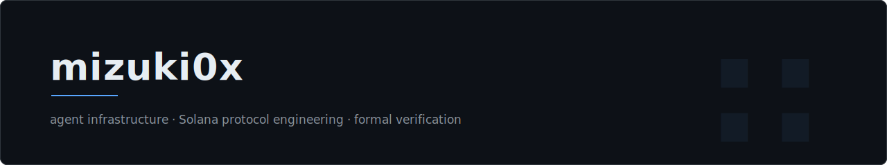

```rust
struct Engineer {
    role: &'static str,
    org: &'static str,
    focus: [&'static str; 4],
}

const MIZUKI: Engineer = Engineer {
    role: "protocol engineer",
    org: "@open-covenant",
    focus: [
        "agent runtimes and audit layers",
        "Solana programs (Anchor, Pinocchio)",
        "formal verification with Kani",
        "payment rails for autonomous agents",
    ],
};
```

### Agent infrastructure

An operating layer for long-running engineering agents. Rust daemon, signed capabilities, append-only audit, commit-scoped provenance.

<p>
  <a href="https://github.com/open-covenant/covenant">
    
  </a>
  <a href="https://github.com/open-covenant/covenant-skill">
    
  </a>
</p>

### Solana protocol engineering

Programs and tooling for agents that transact on chain. Escrow, reputation, and dispute flows, plus a CLI for simulating and operating perp markets.

<p>
  <a href="https://github.com/mizuki0x/kamiyo-protocol">
    
  </a>
  <a href="https://github.com/kamiyoai/percli">
    
  </a>
</p>

### Formal verification

Proof harnesses for Solana program invariants, built on Kani and packaged as reusable primitives. Published on crates.io as [`kamiyo-kani`](https://crates.io/crates/kamiyo-kani).

<p>
  <a href="https://github.com/mizuki0x/kamiyo-kani">
    
  </a>
</p>

### Upstream

Merged work in codebases I don't own.

- [model-checking/kani#4547](https://github.com/model-checking/kani/pull/4547) · SARIF output for GitHub Code Scanning, in AWS's Kani model checker
- [x402-foundation/x402#1108](https://github.com/x402-foundation/x402/pull/1108) · KAMIYO in the x402 ecosystem
- [Swader/x402facilitators#2](https://github.com/Swader/x402facilitators/pull/2) · KAMIYO as a multi-chain payment verification facilitator
- [OOBE-PROTOCOL/synapse-client-sdk#10](https://github.com/OOBE-PROTOCOL/synapse-client-sdk/pull/10) · KAMIYO protocol tools for the Synapse client SDK

### Covenant

Covenant is an operating layer for autonomous engineering agents: identity, permissions, audit.

[opencovenant.org](https://opencovenant.org) · [](https://doi.org/10.5281/zenodo.20134416)

---

<p>
  
  
</p>
